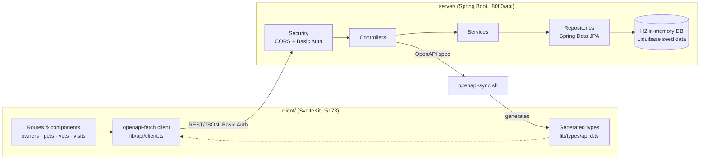
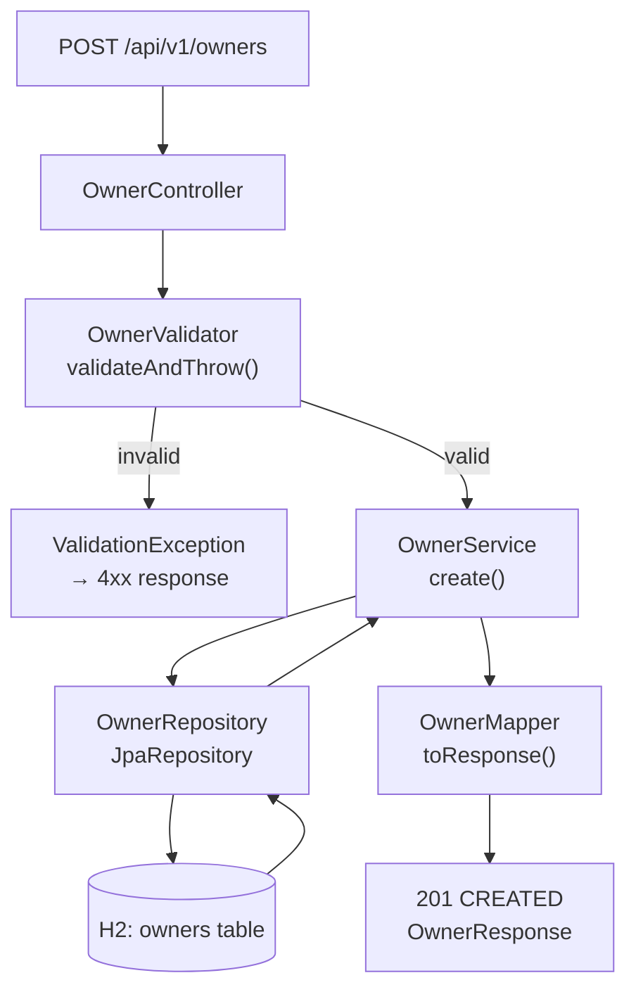

# VetHub

VetHub is a full-stack veterinary clinic management application, structured as a Spring Boot 4.1 (Java 25) REST API backend paired with a SvelteKit 2 (Svelte 5, TypeScript) frontend, that lets clinic staff track pet owners, their pets, veterinarians, and clinic visits: owners can be created and searched, each owner can have multiple pets (each with a type like Cat, Dog, or Hamster), pets accumulate visit records over time, and vets are each associated with one or more specialties (e.g. Radiology, Surgery, Dentistry). It's used as the codebase for the ilionx SkillLab "AI-driven Development" workshop with [OpenCode](https://opencode.ai).

- **Backend**: Spring Boot (Java 25), Gradle, H2 in-memory DB
- **Frontend**: SvelteKit 2 + Svelte 5, Tailwind CSS, bun
- **Toolchain**: managed by [mise](https://mise.jdx.dev)

No Docker required — H2 is in-memory and the backend runs directly with Gradle.

## Architecture

Two main components, talking over REST/JSON:



### `server/` — Spring Boot 4.1 (Java 25), built with Gradle

- Feature-first package structure under `dev.ilionx.workshop.api`: `owner/`, `pet/`, `vet/`, `visit/` — each a vertical slice with its own `Controller` → `Service` → `Repository` → `Model`/entity.
- **Data layer**: Spring Data JPA over an in-memory H2 database, schema/seed data managed by **Liquibase** migrations (so the DB resets and reseeds with sample owners/pets/vets on every restart).
- **Mapping**: MapStruct generates the DTO ↔ entity converters (request/response objects vs. JPA entities).
- **API docs**: springdoc-openapi auto-generates an OpenAPI spec and Swagger UI from the controllers, served under `/api/v1/public/docs`.
- **Security**: Spring Security is wired up with CORS + HTTP Basic auth (`WebSecurityConfig`), but currently `anyRequest().permitAll()` — auth headers are sent by the client but not actually enforced yet (a deliberate "permit all by default" starting point).
- Runs on port 8080 with context path `/api`, so real endpoints look like `http://localhost:8080/api/v1/owners`.

### `client/` — SvelteKit 2 / Svelte 5, TypeScript, Tailwind, built with bun/Vite

- Routes mirror the domain: `routes/owners`, `routes/pets`, `routes/vets`, `routes/visits`, each with list/detail/new pages, backed by feature-scoped components (`lib/components/owners`, `lib/components/pets`, `lib/components/vets`, `lib/components/layout`).
- **API client**: `lib/api/client.ts` uses `openapi-fetch`, a type-safe fetch wrapper generated against the backend's live OpenAPI spec (`lib/types/api.d.ts`), so the frontend gets compile-time-checked request/response shapes instead of hand-written interfaces.

### How they communicate

- Plain HTTP/JSON REST calls from the SvelteKit app to `http://localhost:8080/api/...`, with an `Authorization: Basic ...` header (credentials default to `user`/`password`, overridable via `VITE_API_USERNAME`/`VITE_API_PASSWORD` env vars) and `Content-Type: application/json`.
- CORS on the backend (`security.cors.allowed-origin`) explicitly allows any `localhost:*` origin with credentials, so the two dev servers (5173 and 8080) can talk cross-origin without extra proxying.
- **The bridge between the two stacks is the OpenAPI spec itself**: `scripts/openapi-sync.sh` boots the backend, downloads its live `openapi.json`, and regenerates the frontend's TypeScript types from it — so backend controller changes flow into frontend type safety via `bun run sync:api` rather than manually kept-in-sync interfaces.

**Tooling that ties it together**: `mise.toml` pins Java 25, Node 22, Bun, and OpenCode versions for the whole repo, so both halves (and the AI tooling) use consistent, reproducible versions regardless of what's installed system-wide.

## Package structure & request flow

The backend is organized **feature-first**, not layer-first: each domain (`owner/`, `pet/`, `vet/`, `visit/`) is a vertical slice under `server/src/main/java/dev/ilionx/workshop/api/` that repeats the same internal shape:

```
owner/
  controller/   OwnerController.java
  service/      OwnerService.java
  repository/   OwnerRepository.java
  model/
    Owner.java                    -- JPA entity
    request/                      -- CreateOwnerRequest, UpdateOwnerRequest
    response/                     -- OwnerResponse, PetSummaryResponse
    mapper/                       -- OwnerMapper (MapStruct)
    validator/                    -- OwnerValidator
```

`pet/`, `vet/`, and `visit/` all mirror this structure, so understanding one domain gets you all four.

Request flow through the `owner` slice for `POST /api/v1/owners`:



Every mutating endpoint (`POST`/`PUT`) validates the request via the domain's `Validator` before touching the `Service`; `create`/`update` build or mutate the JPA entity directly and save it via the `Repository`; the `Mapper` (MapStruct-generated) converts entities to response DTOs on the way out.

## Prerequisites

- [mise](https://mise.jdx.dev) installed (`brew install mise` on macOS, or `curl https://mise.run | sh`)
- Git
- GitHub Copilot access, or another AI provider key (OpenAI, Anthropic, etc.) — OpenCode supports multiple providers

Everything else (Java 25, Node 22, Bun, OpenCode) is pinned in [`mise.toml`](mise.toml) and installed by mise — no manual installs needed.

> **Windows users**: run the whole workshop inside WSL 2. Install with `wsl --install` from an admin PowerShell, then do every step below (git, mise, opencode) inside the Ubuntu/WSL terminal — don't mix Windows-native and WSL tooling. `localhost:8080` / `localhost:5173` are reachable from your Windows browser with no extra config.

## Setup

### 1. Fork and clone

Fork [github.com/Q24/vethub](https://github.com/Q24/vethub) to your own account (don't clone the original directly — you won't have push access), then:

```bash
git clone https://github.com/YOUR-USERNAME/vethub.git
cd vethub
git checkout -b workshop/YOUR-NAME
git push -u origin workshop/YOUR-NAME
```

If `git push` fails with a `403`/permission error even though the fork is yours, it's usually a stale credential for a *different* GitHub account than the fork owner. Check with `gh auth status` — if the wrong account is active, run `gh auth switch --user <fork-owner>` and `gh auth setup-git` to make git actually use it (git's `credential.helper` can otherwise keep using an old cached token, e.g. via macOS `osxkeychain`, regardless of which `gh` account is active).

### 2. Install tooling with mise

```bash
mise trust      # trust this repo's mise.toml
mise install    # installs java 25, node 22, bun, opencode at pinned versions
```

Then **activate mise in your shell** — this is the most common setup issue, since without it `java`/`node`/`opencode` keep resolving to system versions (or nothing) outside of an explicit `mise exec --`:

```bash
# zsh
echo 'eval "$(mise activate zsh)"' >> ~/.zshrc && exec zsh

# bash
echo 'eval "$(mise activate bash)"' >> ~/.bashrc && exec bash
```

If that append fails with "permission denied", your rc file may be owned by `root` instead of you (check with `ls -la ~/.zshrc`) — fix with `sudo chown $(whoami) ~/.zshrc` first.

Verify:

```bash
which java       # should be under ~/.local/share/mise
which node       # same
java -version    # 25+
node --version   # 22+
opencode --version
```

### 3. Start the backend

```bash
cd server
./gradlew bootRun
```

Runs in the foreground (no prompt returned — that's normal; `Ctrl+C` to stop, open a new tab to keep working). First run takes 30–60s while Gradle downloads dependencies. Wait for `Started Application`.

Verify it's running:

| Endpoint | URL | Expected |
|---|---|---|
| Swagger UI | http://localhost:8080/api/v1/public/docs/swagger-ui/index.html | API documentation page |
| Owners API | http://localhost:8080/api/v1/owners | JSON array of owners |
| Pets API | http://localhost:8080/api/v1/pets | JSON array of pets |
| Vets API | http://localhost:8080/api/v1/vets | JSON array of vets |
| Visits API | http://localhost:8080/api/v1/visits | JSON array of visits |

The H2 database seeds itself automatically on startup with sample owners, pets, vets, specialties, and visits.

### 4. Start the frontend

In a second terminal:

```bash
cd client
bun install
bun run dev
```

> The repo is set up for **bun** (`bun.lock`, and `bun` is what's pinned in `mise.toml`) — use `bun`, not `npm`, so installs stay consistent with the lockfile.

Also runs in the foreground. Open [http://localhost:5173](http://localhost:5173) — you should see the VetHub dashboard with nav links to **Owners**, **Pets**, **Veterinarians**, and **Visits** (plus a theme switcher in the header — Light/Dark/Pawsome). Click through each to confirm they load data from the backend.

### 5. IDE setup

**IntelliJ IDEA** (recommended for backend work): open the `server` folder, accept the Gradle import prompt, set the Project SDK to Java 25+, and enable annotation processing (Settings → Build → Compiler → Annotation Processors).

**VS Code**: install the Extension Pack for Java and the Svelte extension, then open the repo root — it detects the Gradle and SvelteKit projects automatically.

### 6. Connect OpenCode to a model

If you installed via mise, OpenCode is already installed. Open it in the project directory and connect:

```bash
cd vethub
opencode
```

Inside the OpenCode session, run:

```
/connect
```

and pick a provider:

| Provider | When to use |
|---|---|
| GitHub Copilot | You have an active Copilot subscription — no extra cost |
| OpenCode Zen | No Copilot; sign up at [opencode.ai/auth](https://opencode.ai/auth) |

## Verify your setup

Before the workshop, confirm all three:

1. **Backend responds to API requests** — the Step 3 table above all return real data.
2. **Frontend displays the VetHub dashboard** — `localhost:5173` loads with working Owners/Pets/Vets/Visits pages.
3. **OpenCode is connected to a model**:
   ```bash
   opencode auth list
   # → should list at least one credential/provider, not "0 credentials"
   ```

If all three check out, you're ready for the workshop.

## Project structure

```
client/   SvelteKit frontend (bun, Vite, Tailwind)
server/   Spring Boot backend (Gradle, Java 25)
scripts/  Dev utility scripts (see below)
```

## Quick reference

| Task | Command |
|---|---|
| Start backend | `cd server && ./gradlew bootRun` |
| Start frontend | `cd client && bun run dev` |
| Run backend tests | `cd server && ./gradlew test` |
| Format code | `cd server && ./gradlew spotlessApply` |
| Regenerate API types | `cd client && bun run sync:api` |
| Check frontend types | `cd client && bun run check` |

`sync:api` runs [`scripts/openapi-sync.sh`](scripts/openapi-sync.sh): starts the backend, fetches the OpenAPI spec, regenerates TypeScript types into `client/src/lib/types/api.d.ts`, then stops the backend again.

## Continuous Integration

[`.github/workflows/backend-tests.yml`](.github/workflows/backend-tests.yml) runs `./gradlew test` on every push to `main` or a `workshop/*` branch, and on pull requests targeting `main`. Test reports are uploaded as a build artifact on each run, so a failure is inspectable from the Actions tab, not just a red X.

## Troubleshooting

- **`mise` errors about untrusted config**: run `mise trust` from the repo root.
- **`which java`/`which node` don't point to a mise path**: your shell isn't activated — repeat the activation step above and open a new terminal.
- **Can't write to `~/.zshrc` / `~/.bashrc`**: check ownership with `ls -la` — if it's owned by `root`, run `sudo chown $(whoami) ~/.zshrc`.
- **`git push` denied on your own fork**: check `gh auth status` for the wrong active account, then `gh auth switch --user <you>` and `gh auth setup-git`.
- **`opencode auth list` shows `0 credentials`**: run `opencode` then `/connect` inside the session, and complete the provider login.
- **Backend won't start / port 8080 in use**: check for a stray process with `lsof -i :8080`, or stop lingering Gradle daemons with `./gradlew --stop`.
- **Frontend shows a CORS error**: confirm the backend is running on port 8080 — the default CORS policy (`security.cors.allowed-origin`) allows any `localhost` origin.

## Questions?

If you run into issues during setup, contact Jordi Jaspers or Rutger Lubbers.
